# ERD — Cinlove SaaS Platform

## Diagram

```mermaid
erDiagram

  %% ─── PLATFORM / IAM ───────────────────────────────────────────────
  users {
    uuid        id                      PK
    varchar     email                   UK
    varchar     password_hash
    varchar     full_name
    varchar     avatar_url
    varchar     refresh_token_hash
    varchar     reset_password_token
    timestamptz reset_password_expires
    timestamptz created_at
    timestamptz updated_at
  }

  tenants {
    uuid        id              PK
    varchar     name
    varchar     slug            UK "subdomain: slug.cinlove.vn"
    varchar     logo_url
    varchar     primary_color
    text        description
    numeric     commission_rate "Cinlove cut %"
    jsonb       payout_info     "bank account details"
    timestamptz created_at
    timestamptz updated_at
  }

  tenant_members {
    uuid        id              PK
    uuid        tenant_id       FK
    uuid        user_id         FK
    varchar     role            "owner | admin | editor"
    timestamptz joined_at
  }

  %% ─── SUBSCRIPTION ──────────────────────────────────────────────────
  subscription_plans {
    uuid        id              PK
    varchar     name            "Free | Pro | Business | Enterprise"
    numeric     price_monthly
    numeric     price_yearly
    int         max_templates
    int         max_members
    boolean     custom_domain
    boolean     analytics
    boolean     marketplace_listing
    boolean     ai_byok         "được phép cấu hình API key AI riêng"
    boolean     is_active
  }

  subscriptions {
    uuid        id              PK
    uuid        tenant_id       FK
    uuid        plan_id         FK
    varchar     status          "active | cancelled | past_due | trialing"
    timestamptz current_period_start
    timestamptz current_period_end
    boolean     cancel_at_period_end
    varchar     provider        "vnpay | stripe"
    varchar     provider_sub_id
  }

  subscription_events {
    uuid        id              PK
    uuid        subscription_id FK
    uuid        tenant_id       FK
    varchar     event_type      "created | renewed | upgraded | downgraded | cancelled | reactivated | past_due"
    uuid        from_plan_id    FK "null = lần đầu tạo"
    uuid        to_plan_id      FK
    numeric     amount_paid
    varchar     currency
    varchar     provider        "vnpay | stripe"
    varchar     provider_txn_id
    timestamptz period_start
    timestamptz period_end
    timestamptz created_at
  }

  %% ─── STOREFRONT ────────────────────────────────────────────────────
  storefronts {
    uuid        id                        PK
    uuid        tenant_id                 FK "1-to-1"
    varchar     custom_domain
    boolean     domain_verified
    varchar     domain_verification_token
    varchar     banner_url
    text        welcome_text
    varchar     seo_title
    varchar     seo_description
    varchar     theme_color
    jsonb       social_links
    boolean     is_active
  }

  %% ─── CATALOG ───────────────────────────────────────────────────────
  template_categories {
    uuid        id              PK
    uuid        parent_id       FK "self-ref for subcategories"
    varchar     name
    varchar     slug            UK
    varchar     icon_url
  }

  templates {
    uuid        id                    PK
    uuid        tenant_id             FK
    uuid        created_by            FK "users.id"
    uuid        category_id           FK
    uuid        current_version_id    FK "template_versions.id, null khi chưa publish"
    varchar     title
    text        description
    varchar     thumbnail_url
    varchar     status                "draft | published | archived"
    numeric     price
    varchar     currency              "VND | USD"
    int         view_count
    int         purchase_count
    timestamptz published_at
    timestamptz created_at
    timestamptz updated_at
  }

  template_versions {
    uuid        id              PK
    uuid        template_id     FK
    uuid        saved_by        FK "users.id"
    int         version_number
    jsonb       canvas_data     "snapshot canvas tại thời điểm publish"
    varchar     change_note
    timestamptz created_at
  }

  template_variables {
    uuid        id              PK
    uuid        template_id     FK
    varchar     key             "e.g. bride_name"
    varchar     label           "e.g. Tên cô dâu"
    varchar     type            "text | date | image | number | color"
    boolean     required
    text        default_value
    varchar     placeholder
    int         sort_order
  }

  %% ─── MEDIA ─────────────────────────────────────────────────────────
  media_files {
    uuid        id              PK
    uuid        tenant_id       FK "null = platform-level"
    uuid        uploaded_by     FK "users.id, null = customer upload"
    varchar     original_name
    varchar     mime_type
    bigint      size_bytes
    varchar     url
    varchar     storage_key
    timestamptz created_at
  }

  %% ─── CUSTOMER ──────────────────────────────────────────────────────
  customers {
    uuid        id              PK
    varchar     email           UK
    varchar     full_name
    varchar     phone
    varchar     password_hash   "null = guest checkout"
    boolean     email_verified
    timestamptz created_at
  }

  %% ─── COMMERCE ──────────────────────────────────────────────────────
  orders {
    uuid        id              PK
    uuid        tenant_id       FK
    uuid        customer_id     FK "null = guest"
    varchar     customer_email  "denormalized for guest"
    varchar     customer_name
    varchar     status          "pending | paid | failed | refunded"
    numeric     subtotal
    numeric     platform_fee    "Cinlove commission"
    numeric     tenant_revenue
    varchar     currency
    timestamptz created_at
    timestamptz paid_at
  }

  order_items {
    uuid        id              PK
    uuid        order_id        FK
    uuid        template_id     FK
    varchar     template_title  "snapshot at purchase time"
    numeric     unit_price
  }

  payments {
    uuid        id              PK
    uuid        order_id        FK
    varchar     provider        "vnpay | momo | stripe"
    varchar     provider_txn_id UK
    numeric     amount
    varchar     currency
    varchar     status          "pending | success | failed | refunded"
    jsonb       provider_response
    timestamptz created_at
    timestamptz updated_at
  }

  %% ─── INVITATION ────────────────────────────────────────────────────
  invitations {
    uuid        id                      PK
    uuid        order_item_id           FK
    uuid        template_id             FK
    uuid        template_version_id     FK "version tại thời điểm mua"
    uuid        customer_id             FK "null = guest"
    varchar     customer_email
    uuid        access_token            UK "guest access, sent via email"
    varchar     public_slug             UK "shared link: slug.cinlove.vn/w/lan-minh"
    boolean     is_public
    int         view_count
    timestamptz created_at
    timestamptz updated_at
    timestamptz expires_at
  }

  invitation_variables {
    uuid        id              PK
    uuid        invitation_id   FK
    varchar     variable_key    "matches template_variables.key"
    text        value_text
    jsonb       value_json      "for image/structured data"
    timestamptz updated_at
  }

  %% ─── AI ────────────────────────────────────────────────────────────
  tenant_ai_configs {
    uuid        id              PK
    uuid        tenant_id       FK
    varchar     feature         "template_gen | image_gen | variable_extract"
    varchar     provider        "anthropic | openai | google | stability"
    varchar     model           "claude-sonnet-4-6 | gpt-4o | gemini-2.0 | ..."
    text        api_key_enc     "mã hóa AES trước khi lưu"
    boolean     is_active
    timestamptz created_at
    timestamptz updated_at
  }

  ai_generation_logs {
    uuid        id              PK
    uuid        tenant_id       FK
    uuid        user_id         FK "users.id"
    uuid        config_id       FK "tenant_ai_configs.id"
    varchar     feature         "template_gen | image_gen | variable_extract"
    text        prompt
    varchar     provider
    varchar     model
    int         tokens_input
    int         tokens_output
    numeric     cost_usd
    varchar     status          "success | failed | rejected"
    uuid        result_id       "template_id hoặc media_file_id"
    timestamptz created_at
  }

  %% ─── PAYOUT ────────────────────────────────────────────────────────
  payouts {
    uuid        id              PK
    uuid        tenant_id       FK
    date        period_start
    date        period_end
    varchar     status          "pending | processing | paid | failed"
    numeric     gross_amount
    numeric     platform_fee
    numeric     net_amount
    timestamptz paid_at
    varchar     payment_ref
  }

  payout_items {
    uuid        id              PK
    uuid        payout_id       FK
    uuid        order_item_id   FK
    numeric     amount
  }

  %% ─── RELATIONSHIPS ─────────────────────────────────────────────────

  tenants             ||--o{  tenant_members       : "has members"
  users               ||--o{  tenant_members       : "belongs to"

  tenants             ||--||  storefronts          : "has storefront"
  tenants             ||--o{  templates            : "owns"
  tenants             ||--o{  orders               : "receives"
  tenants             ||--o{  payouts              : "receives"

  users               ||--o{  templates            : "created by"

  subscription_plans  ||--o{  subscriptions        : "defines"
  tenants             ||--o{  subscriptions        : "subscribes"

  subscriptions       ||--o{  subscription_events  : "logs"
  tenants             ||--o{  subscription_events  : "has history"
  subscription_plans  ||--o{  subscription_events  : "from plan"
  subscription_plans  ||--o{  subscription_events  : "to plan"

  template_categories ||--o{  template_categories  : "parent of"
  template_categories ||--o{  templates            : "categorizes"
  templates           ||--o{  template_variables   : "has variables"
  templates           ||--o{  template_versions    : "has versions"
  templates           ||--o{  invitations          : "instanced as"
  template_versions   ||--o{  invitations          : "locked in"
  users               ||--o{  template_versions    : "saved by"

  tenants             ||--o{  media_files          : "stores"

  customers           ||--o{  orders               : "places"
  orders              ||--o{  order_items          : "contains"
  orders              ||--||  payments             : "paid via"
  order_items         ||--||  invitations          : "generates"

  invitations         ||--o{  invitation_variables : "filled with"
  customers           ||--o{  invitations          : "owns"

  payouts             ||--o{  payout_items         : "includes"
  order_items         ||--o{  payout_items         : "allocated to"

  tenants             ||--o{  tenant_ai_configs    : "configures AI"
  tenant_ai_configs   ||--o{  ai_generation_logs   : "used in"
  tenants             ||--o{  ai_generation_logs   : "usage by"
  users               ||--o{  ai_generation_logs   : "triggered by"
```

---

## Ghi chú thiết kế

### Multi-tenancy
- Mọi query **bắt buộc** filter `tenant_id` — dùng Postgres Row Level Security (RLS) hoặc middleware.
- `tenants.slug` → subdomain routing: `{slug}.cinlove.vn`.
- `storefronts.custom_domain` → tenant Enterprise có thể dùng domain riêng.

### Template & Variable System
- `templates.canvas_data` lưu toàn bộ JSON canvas (elements, kích thước, background).
- `template_variables` định nghĩa các "ô điền" — mỗi variable có `key` khớp với element trong canvas.
- Khi render Fill Mode: thay `element.content` bằng `invitation_variables.value_text` tương ứng.

### Guest Checkout
- `orders.customer_id` nullable → khách mua không cần tài khoản.
- `invitations.access_token` (UUID) gửi qua email → truy cập không cần login.
- Khách có thể tạo tài khoản sau → link `customer_id` vào các đơn hàng cũ bằng email.

### Commerce & Payout
- Cinlove collect toàn bộ payment → cuối kỳ tạo `payouts` cho từng tenant.
- `orders` lưu cả `platform_fee` và `tenant_revenue` (snapshot tại thời điểm mua, vì `commission_rate` có thể thay đổi).
- `order_items.template_title` snapshot tên template để hiển thị lịch sử dù template bị xóa sau này.

### Invitation Sharing
- `invitations.public_slug` → URL public: `{tenant_slug}.cinlove.vn/w/{public_slug}`
- `invitations.is_public` = false → chỉ xem qua `access_token`.
- `invitations.view_count` → analytics cho tenant.

### Subscription Tiers (gợi ý)
| Plan       | Templates | Members | Custom Domain | Marketplace | Analytics |
|------------|-----------|---------|---------------|-------------|-----------|
| Free       | 3         | 1       | ✗             | ✗           | ✗         |
| Pro        | 20        | 3       | ✗             | ✓           | Basic     |
| Business   | Unlimited | 10      | ✓             | ✓           | Full      |
| Enterprise | Unlimited | ∞       | ✓             | ✓           | Full+API  |
